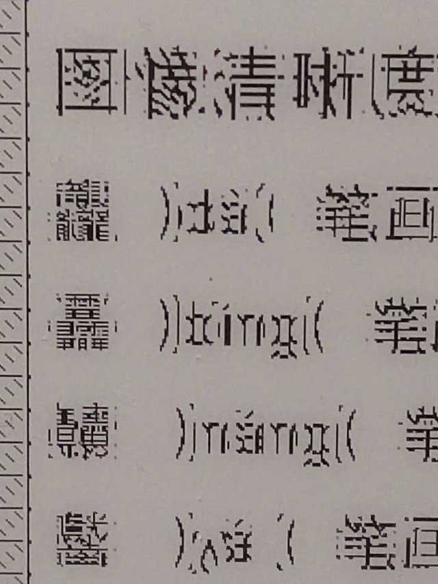
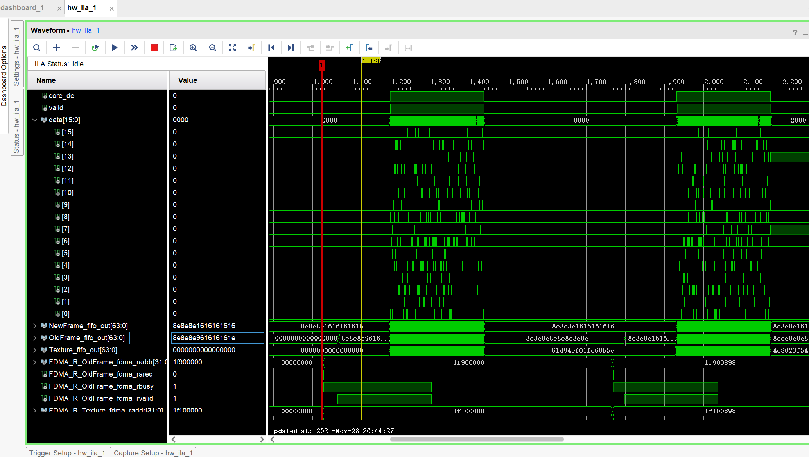

# Zynq7010_eink_controller

### 20220311 发布正式版 Eink 控制器 V1.0 现仅测试ED097TC2刷新...稳定快速√

### 由于学业原因项目暂停更新 见谅~

## 这是一个基于Zynq7010的Eink控制器

#### 20220321 警告：若使用 TPS65185 驱动电子墨水屏请慎重考虑并且采用比官方规格书要求的性能更好的器件！否则有概率电感突然冒烟

#### 20220624 Boooooooom...<br/>

### 如果不是自己的创作，少女是会标识出来的，所以要告诉别人是少女写的哦[[dtysky|一个行者的轨迹](http://dtysky.moe/)]。

| 开发软件       | Versino                                 |
| -------------- | --------------------------------------- |
| Vivado         | 2020.2                                  |
| Vitis          | 2020.2                                  |
| Sublime Text3  | 3.2.2, Build 3211                       |
| Icarus Verilog | 12.0 (devel) (s20150603-1110-g18392a46) |

这是他学FPGA以来做的第一个项目，效果算还行但是代码确实写的不太好。

## 负壹/支持

| 型号     | 尺寸 | 分辨率                 | 连接器               | 兼容                     |
| -------- | ---- | ---------------------- | -------------------- | ------------------------ |
| ET017QC4 | 1.73 | 320(S)x240(G)          | FH26W-39S-0.3SHW(60) | 显示器测试通过           |
| ET047TC1 | 4.7  | 960(S)x540(G)          | AXE544124            | 彩条滑窗测试通过         |
| ED052TC4 | 5.2  | 1280(S)x720(G)         | AXE550124            | 彩条滑窗及显示器测试通过 |
| ET068SC1 | 6.8  | 800(S)x600(G)          | FH26W-39S-0.3SHW(60) | 彩条滑窗测试通过         |
| ET073TC1 | 7.33 | 750x200[375(S)x400(G)] | THD0515-34CL-SN      | 彩条滑窗测试通过         |
| ED097TC2 | 9.7  | 1200(S)x825(G)         | THD0510-33CL-GF      | 显示器测试通过           |
| ES108FC1 | 10.8 | 1920(S)x1080(G)        | AXE650124            | 彩条滑窗及显示器测试通过 |
| ES133UT1 | 13.3 | 1600(S)x1200(G)        | FH26W-39S-0.3SHW(60) | 显示器测试未通过         |


## 〇/绪

三年前，他拥有了第一块9.7寸电子墨水屏幕以及一片来着微雪的IT8951。

他一直有一个小小的梦想~用那块刷新慢悠悠的墨水屏玩《Minecraft》

他从一个连游戏都不会安装的少年从零开始。花了三年，从Win上位机通过USB控制IT8951做到0.5FPS刷新到使用树莓派控制IT8951实现4FPS刷新👉[Hanley-Yao/IT8951_E-paper_Display_Demo: 树莓派上的IT8951 E-paper演示程序 (github.com)](https://github.com/Hanley-Yao/IT8951_E-paper_Display_Demo)👈最后在多方帮助下学了一些FPGA实现了他人生第一个FPGA项目Zynq7010_eink_controller，他终于实现了三年前的梦想！


因为热爱，可迎万难。虽然他知道自己很菜，但是他总能硬着头皮上，总会开口向大佬请教，但也总会浪费money...

他花了半年时间，做了大佬口中“这不是三天就能做完的项目吗？”。确实如此，他知道自己的能力有限，在学业最为紧张的高中阶段这是对学习时间的极大浪费，以至于他现在是年段倒数。

或许他该做一些改变。从前他只会用标准库实现某些算法或功能并未深究实现的原理，但是在FPGA上并非如此。一切都是底层，他需要懂很多东西。数电模电...数学等等等等...他越发感到自己会的实在太少太少，考上一个好大学有多重要。或许做出停更项目的决定很困难，但是他依然做出了这样的决定。做项目的这半年，他错过了很多美好，因为改变他将重新拥有。

## 壹/如何开始

首先本项目目前仅测试ED097TC的显示效果。虽然设计上能支持分辨率小于2208*1872接口位宽为8bit的所有元太墨水屏，但是测试ES133UT1时发现显示效果并不近人意，画面褪色卡顿并伴有错位现象。

| 实验硬件环境 |                                       |
| ------------ | ------------------------------------- |
| 屏幕         | ED097TC2                              |
| 屏幕电源     | TPS65185                              |
| FPGA开发板   | MicroPhase Z7-Lite (Zynq7010)         |
| HDMI2RGB     | [米联客 FEP扩展卡] HDMI7611 (ADV7611) |

#### 1) 确认硬件

如果硬件环境和测试的一样可以不考虑...若采用其他的Zynq开发板请确认至少有27个可用IO

| 用途     | 个数                                                         |
| -------- | ------------------------------------------------------------ |
| 屏幕     | 13 (仅8bit屏幕)                                              |
| TPS65185 | 3 (WAKEUP,PWRUP,WAKEUP直接连接到Vcc其实也行)                 |
| ADV7611  | 4 (时钟&同步信号) + 8 (极限情况下可以用YUV模式输出仅采样中的Y通道PS：需要自己改config_reg.v配置，默认情况下是24bit RGB采样) |
| IIC总线  | 2 (配置TPS65185输出Vcom以及ADV7611的寄存器)                  |

项目设计仅在Zynq7010上测试过，项目需要使用到PS部分(但是纯PL可实现,PS部分仅用于转移一些噪声纹理到指定的DDR地址)

电源部分采用TPS65185实现，但是对于这款芯片的性能而言，这是不稳定的！TPS65185常规版本+-15V驱动电流120mA对于常规看漫画的情况是足够的，但是本项目用EPD做高速刷新应用这会导致屏幕功耗比规格书中的测试结果还要大很多。目前测试的在保证给TPS65185供电保持5V以上是可以使用的。但是这并不代表这样没有隐患。

HDMI RX部分尝试过使用Zynq7010的IO直接实现但是发现极限的采样分辨率只有720P兼容性不太好，最后采用ADV7611实现稳定的1080P 60Hz采样。

FPGA到屏幕的连接线过长会导致屏幕花屏显示效果下降...

#### 2) 确认软件

项目开发使用的是Vivado2020.2、Vitis2020.2

在vivado打开本项目eink_controller.v后

① 请根据屏幕上的标签纸修改Vcom值(这很重要，若Vcom值不匹配会影响显示效果并且在频繁刷新屏幕的情况下导致屏幕部分褪色等不良影响！)

② 根据拿到的规格书修改tLEdly、tLEw 、tLEoff这三参数，如果屏幕是ED097TC2保持默认即可。

③ 修改 SYS_CLK_FREQ 与输入时钟频率相匹配  

默认情况下我们让屏幕以10FPS的速度刷新，实测该速度能实现较好的显示质量。当然我们也可以牺牲质量提升速度！

如果需要👇

① 可以加快 EPD_FREQ 频率(记得同时修改eink_controller.v内的值以及clock_pll内的值)

② 可以减小 PERIOD_CNT 的值让每一帧刷新更少的波形周期...

③ 对于以上修改你可能还需要修改 SPL_TIME 的值，它表示在第 PERIOD_CNT - SPL_TIME 周期触发帧采样。合适的值可以减少屏幕延迟的抖动并且降低延迟(影响范围最大也就几十ms)

调整这些参数需要足够的耐心以及对EPD显示原理的深刻理解，所以建议保持默认

#### 3) 生成bit流

在综合之前若板卡不同需要重新约束引脚...

确认约束无误后开始生成bit流...

正常情况下这需要一碗泡面的时间...根据各人电脑不同而异

在生成bit后导出包括bit流在内的xsa文件并在Vitis中打开。

#### 4) 编译与下载

在Vitis中更新工程的xsa文件为最新后，由于上传到git或其他什么原因...我们无法一次性直接编译通过。请尝试复位BSP支持库等重新编译环境，若出现各种找不到可以重新启动Vitis多次尝试。

默认的下载方式中，噪声数据也通过JTAG下载这样会导致下载时间很长，并且是PL端先开始运行，然后PS端才刚开始下载噪声。所以你会看到开始一段时间屏幕有轻微的反应，因为DDR在未被写入之前里面应该是有一些随机数据的，稍安勿躁稍等一会儿即可(有概率失败的...这时候你需要重新下载)。当然也可以改成SD卡存放噪声数据。操作方法在 进阶 中说明。

## 贰/进阶

#### 1) 用法

默认修改过配置给ADV7611的EDID数据，实现了电脑直接识别1200x825分辨率并输出ADV7611支持采样的最大PixClk 165 Mhz实现最小采样延迟，若需要其他分辨率...请修改config_reg.v内的EDID部分

拉低clr_flag对应的IO即可使屏幕刷黑白清除残影...除此之外就没啥特殊功能啦~

#### 2) 图像

细心的你或许已经注意到前文所说的噪声。这是将灰度图像转换为1bit半色调抖动图像的一种方式。详细介绍看大佬文章👉[Free blue noise textures (momentsingraphics.de)](http://momentsingraphics.de/BlueNoise.html)👈项目中采用的纹理也是用大佬提供的工具生成的。

这种抖动算法对于墨水屏来说优势在于不会像误差扩散算法那样会污染不相关的区域。在目标像素灰度值保持不变的情况下是不会出现其他计算结果的。这称为有序抖动，即每一个像素或区域有固定的唯一结果。所以可以实现任意尺度的并行运算。而且实现的复杂度要小于误差扩散算法。

但是不足之处在于细节的表现(高频)表现不如误差扩散算法。我们可以通过调整噪声纹理的标准差来改善这种情况。但无论如何效果还是不如误差扩散。

所以用户需要做的就是找到最适合自己使用的噪声标准差，以提供最佳的视觉体验。

```
ALGO\Blue_Noise_Dithering\BlueNoise.py 可以生成不同尺寸不同标准差的噪声矩阵
```

建议测试时生成分辨率较小的噪声测试满意后生成大面积的噪声。理论上噪声越大效果越好

生成的噪声可以使用

```
ALGO\Initialize_coe\DITHER\rgb2coe.m Matlab可以仿真FPGA处理的结果
```

获得处理结果若满意则可以将 BlueNoise.py 生成的 texture.c 替换 Vitis 工程内包含的同名文件

也可以通过将 texture.bin 移动到SD卡根目录然后在 Vitis 中的 helloworld.c 取消注释掉的 31~99 行并注释 13~29 行实现从SD卡读取噪声。这样就可以不用每一次下载程序都等待很长时间。(切记不可热插拔SD卡...别问我IO是怎么烧掉的/哭笑)


| Log                                                          |
| ------------------------------------------------------------ |
| 20220517<br/>- 由于 Z7-Lite 损坏，因此更换主控为 EBAZ4205 进行部分测试<br/> |
| 20220311<br/>- 发布正式版V1.0<br/><br/> |
| 20220309<br/>-基本上没问题了，但是蓝噪声抖动算法很大程度抑制了高频<br/><br/>-尝试 ES133UT1 效果贼差...<br/> |
| 20220308<br/>-debug一天多，甚至部分重构了帧缓冲器<br/>-结果发现只是数据忘记高低位颠倒.../瘫手<br/><br/><br/> |
| 20220226<br/>-今天修了个clear buf控制器...然后最严重的列错位问题还是没有头绪<br/> |
| 20220225<br/>-问题出在图像处理器上！<br/>-这个问题从 [20211128] 开始就一直存在<br/>-下次一定仿真.jpg<br/> |
| 20220221<br/>     |
| 20220219<br/>-示波器没放稳...送走一片带前光的ED097TC2<br/> |
| 20220205<br/>-部分重构的时候发现之前写的代码时序完全不对...但是上板子却完全没毛病...？ |
| 20220203<br/>-首帧输出仿真<br/> |
| 20210126<br/>- 使用Zynq7010+ADV7611实现了HDMI视频采集并通过蓝噪声纹理处理后显示，但是画面模糊闪烁<br/>- 经过排查FPGA输出的时序并没有出现错误，最后发现是测试PCB走线太长而FPGA的IO本身驱动能力较弱导致的。目前已经着手重新绘制PCB用于接下来的测试工作<br/>- 对大面积高速刷新的屏幕面板而言，目前的电源方案TPS65185实际上功率有一些不足了，但是由于功率更高的供电方案价格和复杂度也有提升，时间紧迫就延用TPS65185作为电源供电。如果读者您有能力时间与精力欢迎加入我的项目！ |
| 20210116<br/>- 通过ADV7611实现了HDMI RX 分辨率1080P 60Hz     |
| 20220107<br/>- 嗯...Zynq7020只能做到720P HDMI RX...果然还是得外挂接收芯片,目前考虑ADV7611或者IT6802 |
| 20211221<br/>- 视频输出测试成功...不过数据时序不太匹配还需要优化<br/>-实验记录：<br/>-FPGA：microphase z7-lite zynq7010<br/>-Power：TPS65185 <br/>-Tool：vivado 2020.2<br/>-XCL：50Mhz 一帧刷十个波形周期<br/>-图像处理算法：蓝噪声抖动(Blue Noise Dithering)<br/>-蓝噪声纹理1024*1024 标准差1.5<br/> |
| 20211220<br/>-还需要再写亿点点代码，然后上板子，然后烧几个IC烧几片屏...大概就能成啦<br/> |
| 20211218<br/>-EINK控制器之...(4.5/6)<br/>-并行移位数据控制器<br/>-另外帧控制器可能得重写...虽然能用但是写的真的太烂了<br/><br/><br/> |
| 20211212<br/>- 目前直接把抖动噪声转换成C矩阵直接用JTAG传输到ARM后转存到DDR的Texture缓冲区暂时解决，不过这样导致了上传程序需要较长时间...<br/> |
| 20211208<br/>-EINK控制器之...(4/6)<br/>-DDR驱动数据缓冲控制器<br/><br/> |
| 20211205<br/>- Z7-lite的SD卡无法使用...估计是IO坏了<br/> |
| 20211128<br/>- EINK控制器之...(3/6)<br/>-图像处理器<br/>-没仿真一次过✓<br/><br/><br/><br/> |
| 20211123<br/>-EINK控制器之...(2/6)<br/>-DDR读出控制器<br/>-看起来没毛病明天修理代码后天写图像处理<br/> |
| 20211114<br/>- EINK控制器之...(1/6)<br/>-DDR双帧缓冲器<br/>-测定延迟29640ns<br/> |
| 20211107<br/>- 帧缓冲器开发进入正轨。第一部分写入DDR模型建立并通过行为仿真 |
| 20211123<br/>- 采样并写入DDR指定地址以及读出指定地址数据控制器验证通过 |
| 20211031<br/>- 重新画的HDMI RX电路虽然现在能够识别电脑了但是数据读出来全是00000000000000000000<br/>- 目前暂停研究HDMI RX，由于项目需求不得不创建了一个自激的RGB输出IP来支持以后的缓冲区测试和抖动算法测试<br/>- PL PS读写DDR的问题解决了！DDR可任君调教~ |
| 20211030<br/>- 呜呜呜DDR真是磨人的小妖精                     |
| 20211024<br/>- 和大佬聊了一下帧缓冲和抖动处理的流程...大佬告诉我要然数据高耦合...也就是同步的数据最好放在一起处理~于是我设计了一个数据处理的大致流程 详见 Process.vsdx<br/>- 另外新的板子HDMI接口错误修正了...还有板子上一个很傻逼的丝印也修正了... |
| 20211022<br/>- 通过👉[MomentsInGraphics/BlueNoise](https://github.com/MomentsInGraphics/BlueNoise)👈生成的纹理，使用matlab实现了Blue Noise Dithering 输出图像。<br/>- 各人才疏学浅不会使用合适的数学方法评估算法的效果。不过我对比了“八叉树抖动算法”，“ Stucki 误差扩散抖动算法”，“Blue Noise Dithering”。从复杂度而言八叉树最复杂，Blue Noise Dithering最简单而Stucki 误差扩散表现居中。从主观的视觉效果而言也是前者最好后者最差Stucki 误差扩散表现居中。不过由于后者算法简单速度快我决定在项目中使用Blue Noise Dithering |
| 20211014<br/>- 看了YouTube大佬的👉[视频](https://www.youtube.com/watch?v=wS0Gck00nDw)👈后我发现...Blue Noise Dithering似乎比误差扩散更适合我的项目，于是我打算改变原来的计划使用Blue Noise Dithering |
| 20211019<br/>- 坑比JLCEDA官方的封装居然是反的...怪不得我HDMI无论如何怎么调都出不来...还烫手...目前改正了错误重新打板 |
| 20211013<br/>- 尝试了👉[TaoTao-real/video_dither](https://github.com/TaoTao-real/video_dither)👈的抖动模块，在我的FPGA上输出1080P的视频存在明显的问题。<br/>- 我分别在148Mhz，300Mhz和464Mhz的时钟频率下测试这个模块。发现在300Mhz的时候图像质量有明显改善但算不上正常，在464Mhz的时候我的FPGA没反应了...这个模块本身应该是没用问题的，可能我的用法强人所难了吧~ |
| 20211004<br/>- 使用milianke的FDMA IP成功实现RW DDR<br/>- 目前正在写Data controller |
| 20211001<br/>- 国庆节快乐~今天是被劣质电源线坑的一天,供电不足我还以为是芯片击穿了...于是浪费一天时间重新焊接了芯片到器件都全新的板子... |
| 20210930<br/>- 成功从ROM输出图像到屏幕，不过目前数据触发器还存在问题，导致刷新后图像有轻微条纹。仿真的时候没体现出来目前还不太清楚原因。<br/> |
| 20210926<br/>- 实现了输入分辨率和所需XCL频率即可自动生成控制时序的帧控制器，目前测试了ED097TC2以及ES133UT1全局刷黑白没有问题~ |
| 20210919<br/>- 受疫情影响板子到现在都还没有到...<br/>- 通过萝莉分析仪和FPGA片上iLA采集IT8951的控制时序，我逆向了5个控制信号。理论上这五个控制信号还原后只需要通过波形查找表查表就能够刷屏啦~目前五个控制信号和IT8951的几乎相同，并且支持调整硬件分辨率。<br/> |
| 20210915<br/>- 画了支持HDMI_RX和NGFF接口的电源模块的新底板，由于线路部分在5mil所以只能用JLC打样!<br/> |
| 20210913<br/>- 莆田因为疫情不让上学啦，我的板子也还没有到<br/>- 调用👉[Digilent/vivado-library](https://github.com/Digilent/vivado-library)👈实现了HDMI_RX，但是需要重启电脑才能识别到HDMI设备，我使能了HDMI_HPD但是似乎这并没有什么用...也就是目前而言似乎不支持热插拔...哭唧唧!<br/> |
| 20210909<br/>- 原本使用其他大佬绘制的邮票孔连接的TPS65185 MODLE由于我比较菜经常换底板拆装非常麻烦容易损坏。故自己重新绘制了采用NGFF-M-KEY连接器的电源模块。然后09-08 23:40下单09-10 23:40还没投产，可谁让JLC是免费的呢！咕咕咕...咕咕咕...<br/> |
| 20210829<br/>- 调用 👉[AngeloJacobo/FPGA_I2C_Implementation](https://github.com/AngeloJacobo/FPGA_I2C_Implementation)👈 模块实现FPGA硬件I2C通信，顺利驱动了TPS65185模块! |
| 20210828<br/>- 由于在目前的规划中，几乎用不到PS端，所以打算I2C通信直接在PL端上实现以减少搭建系统的复杂度同时提升通用性很苦逼的用Verilog撸I2C模块，网上抄一抄改一改能用就行。<br/>- 由于自身技术不足而且似乎也无需用到完整I2C协议写一个假的I2C或者是完整协议的I2C模块还在考虑中... |
| 20210822<br/>- 完成TPS65185的测试程序...<br/> |
| 20210814<br/>- 今天是七夕节欸...又是单身的一年...            |
| 20210809<br/>- 焊接了新的Z7-Lite测试ED097TC2的小板子，测试发现又画错了好几个地方，飞线解决<br/>- 重新画了新的Z7-Lite测试ED097TC2的小板子，不晓得下次又是哪里出错😂<br/>- 焊接完成新的TPS65185模块，I2C能够识别但是还未能正常工作 |
| 20210805<br/>- 重新绘制并且打样Z7-Lite测试ED097TC2的小板子。打样中，预计20210808到货<br/>- TPS65185模块重新打样到货。懒得焊接，元件可能不够 |
| 20210804<br/>- 实现Verilog状态机读取EC11旋转编码器，效果还可以~<br/>焊接完TPS65185模块...没反应...<br/>- 焊接完Z7-Lite测试ED097TC2的小板子，发现对板接口弄反了以及把旋转编码器的B相误接到开发板的网口IC复位腿上 |
| 20210721<br/>- 使用LCEDA画了一块Z7-Lite测试ED097TC2的小板子，并发送给捷配打样<br/>- 从一个大佬手里扣出了一块TPS65185的Eink电源模块PCB文件，源文件是AD格式由于我不太会用AD转换成LCEDA的格式，打样完成后元器件今天才到齐懒得焊接 |


## 项目目标

### 将输入的图像输出到任意尺寸任意信号(8bit/16bit)的Eink墨水屏[❌]

clone不了请用 https://gitee.com/Hanley-Yao/Zynq7010_eink_controller
